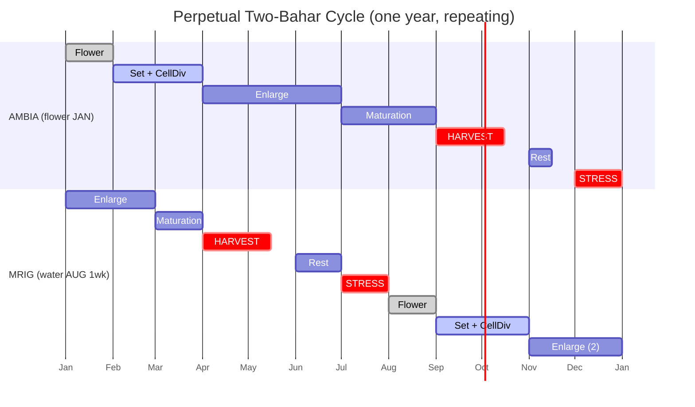

# SCHEDULE 3 — PERPETUAL TWO-BAHAR SYSTEM (Mosambi)

**Your plan:** stress in **December → flower January (Ambia) → harvest Sep-end / Oct-mid**, and stress in **July → water August 1st week (Mrig) → harvest Apr-end / mid-May**. Both crops sit on the tree together, every year. One crop is always lighter than the other — that is normal and expected here.

Doses: **SPRAY = per litre of spray water. DRIP = per 200 L drum (~4 drums/acre). SOIL = per mature (8-yr) tree.** Spray in the **evening**, leaf underside, spreader **last**.

---

## 1. THE CYCLE (diagram)

**Read it:** two natural gaps appear where only **one** crop is on the tree — **June** (after Mrig harvest) and **Oct–Nov** (after Ambia harvest). Those are your **FYM windows** and your **green-manure windows**. The two stress windows are **July** (for Mrig) and **December** (for Ambia).

---

## 2. THE SCHEDULE (month by month, exact doses)

One tree, one spray — each month's mix serves **both** crops, weighted to whichever crop is at its critical stage.

| Month | AMBIA stage | MRIG stage | DRIP (per drum) | SPRAY (per litre) | FYM / SOIL |
|---|---|---|---|---|---|
| **JAN** | Flower (Day 0) | Enlarge | EM 1L OR Jeevamrutha 20L + Nitrobenzene 500ml + Humic 300ml + SOP 1kg + MOE 3L | MKP 5g + NB 1.5ml + Zinc EDTA 1g + Borax 2g + SOP 5g + Seaweed 2ml + Neem 5ml + MOE 2ml + spreader — **NO GA3** | — |
| **FEB** | Set | Enlarge | EM/Jeev 20L + 13:40:13 500g + SOP 1kg + MOE 3L | GA3 0.5ml + NAA 1.5ml/4.5L + Boron 1.5g + SOP 5g + Seaweed 2ml + Neem 5ml · **Ca spray separate:** Calcium Nitrate 5g OR ELE (ALONE) | — |
| **MAR** | Cell division | Maturation | EM/Jeev 20L + SOP 1kg + MOE 3L (**hold N**) | GA3 0.5ml + Zinc 1g + SOP 5g + Seaweed 2ml + Neem 5ml · **Ca separate** | — |
| **APR** | Enlarge | **Harvest (end)** | *(after Mrig cut)* EM/Jeev 20L + 19:19:19 1kg + SOP 1kg + MOE 3L | *(before cut, safe only)* SOP 5g + Zinc 1g + Seaweed 2ml + Neem 5ml + Fe-EDDHA 1g if pale | — |
| **MAY** | Enlarge | Harvest mid → done | EM/Jeev 20L + 19:19:19 1kg + SOP 1kg + MOE 3L · **BIO (alone):** Tricho 10L + Pseudo 10L + PBC 20L | SOP 5g + Banana juice 5% OR Seaweed 2ml + Zinc 1g + Neem 5ml | — |
| **JUN** | Enlarge | Rest | Jeevamrutha 20L + EM 20L + MOE 3L | SOP 5g + Seaweed 2ml + Neem 5ml + Fe-EDDHA if pale | **FYM DOSE-2:** Sheep FYM 20kg + oil cake 1.5kg + Vermicompost 3kg + Avena 100ml + VAM 50g |
| **JUL** | Maturation | **Stress** | *minimal* — MOE 3L + light EM 10L. **Water −50%** | SOP 5g + Seaweed 2ml + Neem 5ml — **NO N** · light prune | Green manure (sunhemp/daincha) sown in basins |
| **AUG** | Maturation | Flower (Day 0, 1wk) | EM/Jeev 20L + Nitrobenzene 500ml + Humic 300ml + MOE 3L | MKP 5g + NB 1.5ml + Zinc 1g + Borax 2g + SOP 5g + Seaweed 2ml + Neem 5ml + MOE 2ml — **NO GA3** | — |
| **SEP** | **Harvest (end)** | Set | *(after Ambia cut)* EM/Jeev 20L + 13:40:13 500g + MOE 3L | *(after cut)* GA3 0.5ml + NAA 1.5ml/4.5L + Boron 1.5g · **Ca separate** · *(before cut)* Seaweed + Coconut 5% + Boron + Neem | — |
| **OCT** | Harvest mid → done | Cell division | Jeevamrutha 20L + EM 20L + 19:19:19 1kg + MOE 3L | GA3 0.5ml + Zinc 1g + 19:19:19 5g + Amino 2ml + Neem 5ml | **FYM DOSE-1 (MAIN):** Sheep FYM 25-30kg + oil cake 2kg + **Gypsum 2kg** + Vermicompost 5kg + Bone meal/SSP 0.5kg + VAM 50g |
| **NOV** | Rest | Enlarge | EM/Jeev 20L + SOP 1kg + 19:19:19 500g + MOE 3L | SOP 5g + Banana juice 5% OR Seaweed 2ml + Zinc 1g + Neem 5ml · **Ca separate** | Green manure dug in |
| **DEC** | **Stress** | Enlarge | *minimal* — MOE 3L only. **Water −50%** | SOP 5g + Seaweed 2ml + Neem 5ml · light prune early Dec | — |

---

## 3. ELABORATION — what happens each month and why

- **JAN — Ambia flowering is the priority.** The Day-0 irrigation after December stress triggers flowering. MKP (0-52-34) + Nitrobenzene + Boron + Zinc drive flower buds with **zero nitrogen**. Mrig (enlarging) only gets potassium (SOP) this month — it runs slightly nitrogen-hungry, which is the accepted trade. **No GA3 at flowering** — GA3 suppresses flower set in citrus.
- **FEB — Ambia sets, GA3 starts.** Once tiny fruit shows, GA3 + NAA hold the fruit and stop drop — this is GA3 in its correct stage. Calcium goes as a **separate** spray (it curdles with phosphorus/sulphate). 13:40:13 gives a little P for set; SOP keeps Mrig sizing.
- **MAR — the tightest month.** Ambia wants nitrogen for cell division; Mrig is maturing and wants **zero** nitrogen. Mrig quality wins — **hold N**. Ambia size is still protected by GA3 + Zinc (cell number does not need N). Full nitrogen waits until April.
- **APR — Mrig harvest (end).** Before picking, spray only market-safe inputs (SOP, seaweed, neem) — no hard insecticide/copper near harvest. After Mrig is off, nitrogen is safe again — start feeding Ambia.
- **MAY — only Ambia left.** A recovery + feeding window. Run Trichoderma + Pseudomonas **alone** (no chemical) for root and trunk health after cropping.
- **JUN — FYM dose-2.** Tree is between crops — safe to rebuild soil. FYM + oil cake feed the finishing Ambia crop and prepare the tree for July stress. Jeevamrutha/EM right after speeds the manure breakdown.
- **JUL — Mrig stress (mild).** You cannot fully stress with Ambia maturing on the tree, so stress is mild (water −50%) and Mrig flowering will be lighter — the "one gets less" you accepted. Protect Ambia with SOP; no nitrogen.
- **AUG — Mrig flowering.** Same flower drive as January (MKP + NB + Boron + Zinc, zero N). The Day-0 water also serves the maturing Ambia; SOP covers Ambia's potassium.
- **SEP — Ambia harvest (end).** Time the GA3 + NAA set-spray for Mrig **right after** Ambia is picked, so Ambia stays residue-clean for market. Before that, use organic set support (seaweed, coconut, boron) on Mrig.
- **OCT — main manuring.** After Ambia harvest, the biggest FYM dose rebuilds the tree and feeds Mrig cell-division (its size ceiling). **Gypsum once a year here** is critical for your pH 8.3 + high salt. Only Mrig on the tree now — feed it hard (N + GA3).
- **NOV — Mrig enlarge, single crop.** Potassium (SOP) + calcium for size and crack-free peel. Banana stem juice adds silicon for peel strength.
- **DEC — Ambia stress begins.** Sets up next January's flowering. Mild only (Mrig still enlarging). Light prune early December. Cycle repeats.

---

## 4. INPUT & EXACT CONCENTRATION (all your inputs)

| Input | EXACT dose | Used in |
|---|---|---|
| Nitrobenzene 35% | 1.5 ml/L spray · 500 ml/drum | Flowering (Jan, Aug) |
| **GA3 0.001%** | **0.5 ml/L (10-15 ppm)** | **SET + cell-div ONLY — never flowering** |
| NAA 4.5% (Planofix) | 1.5 ml / 4.5 L (~15 ppm) | At fruit set |
| MKP 00:52:34 | 5 g/L · 500 g/drum | Flowering |
| SOP 00:00:50 | 5 g/L · 1 kg/drum | Enlarge + maturation |
| 13:40:13 | 5 g/L · 500 g/drum | Early fruit set |
| 19:19:19 | 5 g/L · 1 kg/drum | Cell division (post-set N) |
| Zinc EDTA 12% | 1 g/L | Flowering + cell-div |
| Boron (Borax) | 2 g/L (Boron-20%: 1-1.5 g/L) | Flowering + set |
| Fe-EDDHA 6% (o-o) | 1 g/L | Only when leaves pale |
| Calcium Nitrate 19% | 5 g/L (**SEPARATE**) | Fruit |
| Egg-Lemon Calcium (ELE) | 2.5 L / 1000 L (**SEPARATE**) | Fruit (homemade) |
| Magnesium sulphate | 5 g/L | Interveinal yellowing (old leaf) |
| EM.1 (Hariyali) | 1 L conc OR 20 L activated /drum | Every 15-20 days |
| Jeevamrutha | 20 L/drum | Every 15-20 days (homemade) |
| Vermiwash | 20 L/drum | Quality (homemade) |
| PBC brew | 20 L/drum | With biologicals (homemade) |
| Trichoderma (Bio-cure F) | 10 L/drum OR 5 g/L | Prevention (ALONE) |
| Pseudomonas (Bio-cure B) | 10 L/drum OR 5 g/L | Prevention (ALONE) |
| VAM (mycorrhiza) | 50 g/tree soil | At FYM time |
| Seaweed (Bio-Vita) | 2 ml/L | Flower / set / stress |
| Amino 20% (Isabion) | 2 ml/L | Growth / cell-div |
| FAG (fish amino) | 2.5 ml/L · 2 L/drum | N boost (homemade) |
| Coconut water | 50 ml/L (5%) | Fruit set |
| Banana stem juice | 50 ml/L (5%) | Enlarge (K + silicon) |
| Humic 12% | 2 ml/L · 300 ml/drum | Monthly |
| MOE (citrus extract) | 2-3 ml/L · 3 L/drum | **EVERY drip** (pH) |
| Neem 50000 ppm | 5 ml/L | Pest prevention (homemade) |
| Garlic-ginger extract | 5 ml/L | Fungal/bacterial (homemade) |
| Wood-ash extract (neutralized) | 20-30 ml/L (foliar only) | Late K + B |
| Copper Oxychloride 50% | 3 g/L (**SEPARATE**) | After rain / canker |
| Streptocycline | 0.5 g/L (with copper) | Canker |
| Imidacloprid 17.8% | 0.3 ml/L (evening) | Leaf miner |
| Spreader (WetCit) | 0.3-0.5 ml/L (**LAST**) | Every spray |

---

## 5. COST (MAX usage) + EARNINGS — per acre, per year

**Per acre = ~90 mature trees. Both crops, full input usage.** Prices are your own paid rates where known, else current market. Multiply by your bearing acres.

| Category | Item (annual qty/acre) | Rate ₹ | Cost ₹ |
|---|---|---|---|
| **FYM & soil** | Sheep FYM 4,000 kg | 4/kg | 16,000 |
| | Ganuga chakka / oil cake 200 kg | 50/kg | 10,000 |
| | Gypsum 180 kg | 15/kg | 2,700 |
| | Vermicompost 450 kg | 8/kg | 3,600 |
| | Bone meal / SSP 45 kg + VAM 4.5 kg | — | 1,575 |
| **Foliar** | MKP 10 kg + SOP 15 kg + 19:19:19 10 kg + 13:40:13 3 kg | — | 8,000 |
| | Nitrobenzene 3 L + GA3 1 L + NAA 0.5 L | — | 2,000 |
| | Zinc EDTA 1.5 kg + Borax 3 kg + Fe-EDDHA 1 kg | — | 2,100 |
| | Calcium Nitrate 10 kg + Seaweed 4 L + Amino 2 L + Humic 1 L | — | 4,800 |
| | Spreader 1 L | 2,000/L | 2,000 |
| **Biologicals** | EM 1 L + Trichoderma 2 kg + Pseudomonas 2 kg | — | 1,800 |
| | Jeevamrutha / MOE / PBC / FAG / neem / ELE (homemade ingredients) | — | 2,500 |
| **Pest** | Neem (homemade) + occasional insecticide | — | 2,500 |
| **Labour** | Pruning + sprays + FYM + 2 harvests | — | 18,000 |
| | | **MAX TOTAL** | **≈ ₹77,500 / acre / year** |

### Earnings (per acre, per year — both bahars combined)

Combined mature yield ≈ **~10 tonnes/acre** (Ambia ~5.5 t + Mrig ~4.5 t). Pulivendala price today ₹10–22.6/kg; good-quality fruit reaches the upper end.

| Price | Gross (10 t) | − Max cost | **Net / acre / year** |
|---|---|---|---|
| ₹15/kg | ₹1,50,000 | 77,500 | **₹72,500** |
| ₹20/kg | ₹2,00,000 | 77,500 | **₹1,22,500** |
| ₹25/kg | ₹2,50,000 | 77,500 | **₹1,72,500** |
| ₹30/kg (premium) | ₹3,00,000 | 77,500 | **₹2,22,500** |

> Two bahars give you **two income windows** (Apr-May and Sep-Oct) instead of one — useful for cash flow — but each crop is lighter, so total yield is only modestly higher than one strong bahar, and tree stress is higher. Feed twice and thin both crops.

---

## 6. COST-REDUCTION SCHEDULE (how to spend less)

Your **two biggest costs are FYM + oil cake** (₹26,000/acre of the ₹77,500). Foliar chemicals are small. So real savings come from replacing bought organic matter with **green manure grown in-situ** in the two rest windows (Jun, Oct-Nov) the cycle already gives you — plus using homemade inputs first.

| Scenario | What you change | New cost/acre | You save | Trade-off |
|---|---|---|---|---|
| **A — MAX (full)** | Everything above, full rates | ₹77,500 | — | Best soil build + yield/quality |
| **B — Reduce FYM 50%** | Sheep FYM 2,000 kg; make up with green manure (sunhemp/daincha, seed ~₹300/acre) + extra Jeevamrutha | ₹69,800 | **₹7,700** | Slower humus build; fine on your residual + green manure |
| **C — Reduce oil cake 50%** | Oil cake 100 kg; replace N with FAG (homemade fish amino) + legume green manure | ₹72,500 | **₹5,000** | Less slow-release N — watch leaf colour, top up foliar N |
| **D — MAX SAVINGS** | B + C together, **and**: Borax instead of Boron-EDTA, homemade neem, multiply EM from 1 L, homemade Jeevamrutha/MOE/PBC/FAG/ELE/banana juice for most organics | **≈ ₹58,000** | **≈ ₹19,500** | More of your own labour making inputs; keep the non-substitutable buys (MKP, Zinc-EDTA, Fe-EDDHA, GA3, SOP, Calcium Nitrate) |

**The key move:** sow **green manure (sunhemp / daincha / cowpea) in June and Oct-Nov**, cut and dig it in before the next stress. It fixes nitrogen, adds organic matter, and **de-salts** your soil — doing the oil cake's and part of the FYM's job for the price of seed. This is the single cheapest way to cut your two biggest costs without losing soil health.

**Never cut (these carry the crop on your soil):** Gypsum (de-salts pH 8.3), MOE (pH in every drip), Boron + Zinc + Fe-EDDHA (your soil is deficient), MKP/SOP at their stages, and the live biologicals (Trichoderma/Pseudomonas) that protect the roots carrying two crops.

---

### Sources
- Yield, plants/acre, cost/profit: [Agrifarming — Mosambi Cultivation, Cost and Profits](https://www.agrifarming.in/mosambi-cultivation-cost-profits)
- Current Pulivendala mandi price (₹10–22.6/kg, 25 Sep 2026): [CommodityOnline — Mousambi (Sweet Lime) prices](https://www.commodityonline.com/mandiprices/mousambi-sweet-lime)
- SOP price trend: [Procurement Resource — SOP price trends](https://www.procurementresource.com/resource-center/sop-price-trends)
- Alternate bearing / crop-load stress in citrus: [Citrus Industry — Understanding Crop Load and Alternate Bearing](https://citrusindustry.net/2026/08/14/understanding-crop-load-alternate-bearing/)
- Other input rates: your own spend log (real paid prices).
